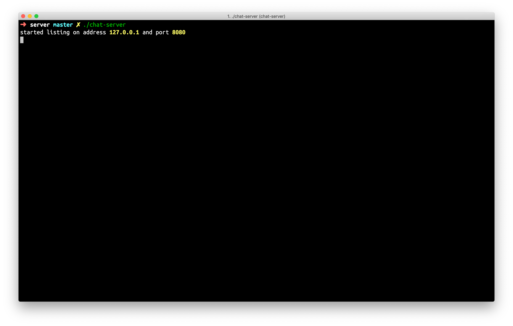
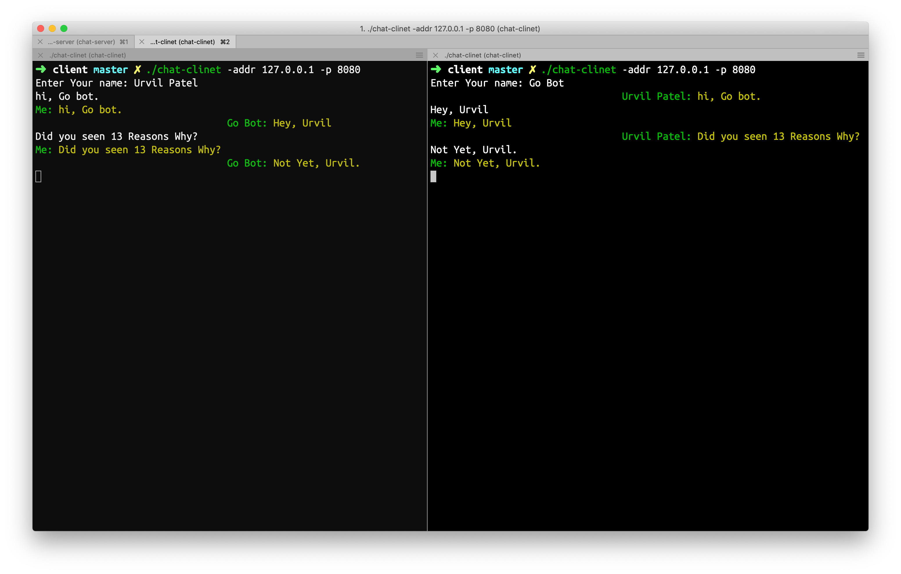

# Message Server




# Build

- If you want to build opa-iptables right away, you need a working [Go environment](https://golang.org/doc/install). It requires Go version 1.12 and above.

```
$ git clone https://github.com/urvil38/chat-server.git
$ cd chat-server
```

## For Linux:

```
$ make linux-build
```

## For MacOs/Darwin:

```
$ make macos-build
```

## For Windows:

```
$ make windows-build
```

In order to gernerate X509 self signed certificates run the `cert.sh` script as following:
```
$ ./cert.sh admin@gmail.com  # which creates certs folder in current directory
```

Now start server and client as following:
```
$ ./bin/chat-server -addr 127.0.0.1 -p 8080
$ ./bin/chat-client -addr 127.0.0.1 -p 8080
```

> You can configure address and port using `-addr` and `-p` command line flags.
> You can configure certs dir using `-cert` command line flag.
